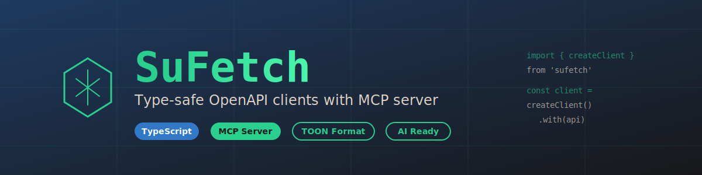

[](https://github.com/productdevbook/sufetch)

# SuFetch

<p>
  <a href="https://www.npmjs.com/package/sufetch"></a>
  <a href="https://www.npmjs.com/package/sufetch"></a>
  <a href="https://github.com/productdevbook/sufetch/blob/main/LICENSE"></a>
  <a href="https://www.typescriptlang.org/"></a>
  <a href="https://github.com/productdevbook/sufetch"></a>
</p>

> Type-safe OpenAPI clients with MCP server for AI-driven API exploration

## Table of Contents

- [Features](#features) · [Installation](#installation) · [Quick Start](#quick-start)
- [MCP Server Setup](#mcp-server-setup) · [Supported APIs](#supported-apis)
- [Development](#development) · [Contributing](#contributing)

---

## What is SuFetch?

SuFetch combines two powerful tools:

1. **Type-Safe API Clients** - Generate fully-typed TypeScript clients from OpenAPI specifications
2. **MCP Server** - Let AI assistants (like Claude) explore your APIs and generate code

Built with [apiful](https://github.com/lisnote/apiful) and [TOON format](https://github.com/toon-format/toon) for efficient OpenAPI spec compression.

## Features

- ✨ **Fully Type-Safe** - Autocomplete and type checking for all API calls
- 🤖 **MCP Integration** - AI assistants can explore and generate code for your APIs
- 📦 **Compressed Specs** - TOON format reduces OpenAPI specs by 40-45%
- 🔄 **Auto-Discovery** - Automatic service detection and type generation
- 🛠️ **Modern Stack** - TypeScript 5.7, ESNext, strict mode
- 🧪 **Well-Tested** - 76+ tests with >60% coverage

## Installation

### For Using the API Client

```bash
# npm
npm install sufetch

# pnpm
pnpm add sufetch

# yarn
yarn add sufetch
```

### For MCP Server (Global)

```bash
# Install globally
npm install -g sufetch

# Verify installation
sufetch-mcp --version
```

### For Development

```bash
git clone https://github.com/productdevbook/sufetch.git
cd sufetch
pnpm install
pnpm build
```

## Quick Start

### Using the Type-Safe API Client

```typescript
import { createClient, cloud } from 'sufetch/hetzner'

// Create a typed client
const client = createClient({
  baseURL: 'https://api.hetzner.cloud/v1',
  headers: {
    'Authorization': 'Bearer your-api-token'
  }
}).with(cloud)

// Fully typed requests and responses
const servers = await client('/servers', {
  method: 'GET'  // ✅ Type-checked
})

// TypeScript knows the response type
console.log(servers.servers)  // ✅ Autocomplete works
```

See [Supported APIs](#supported-apis) for all available services.

### Type Helpers for Advanced Type Safety

Extract specific types from endpoints for maximum type safety:

```typescript
import type { HetznerCloud } from 'sufetch/hetzner'

// Extract request body type
type CreateServerBody = HetznerCloud<'/servers', 'post'>['request']

// Extract response type
type GetServerResponse = HetznerCloud<'/servers/{id}', 'get'>['response']

// Extract query parameters
type ListServersQuery = HetznerCloud<'/servers', 'get'>['query']

// Extract path parameters
type ServerPathParams = HetznerCloud<'/servers/{id}', 'get'>['path']

// Use in functions for type safety
function processServer(server: GetServerResponse) {
  console.log(server.server.id)    // ✅ Full autocomplete
  console.log(server.server.name)  // ✅ Type-checked
}

function createServer(body: CreateServerBody) {
  // TypeScript enforces correct structure
  return client('/servers', {
    method: 'POST',
    body  // ✅ Type-safe
  })
}
```

**Available properties:**
- `['request']` - Request body type
- `['response']` - Success response (200/201)
- `['query']` - Query parameters
- `['path']` - Path parameters
- `['responses'][status]` - Specific status code response

Works with all APIs: `HetznerCloud`, `DigitalOcean`, `OryKaratos`, `OryHydra`.

### Using with AI Assistants (MCP)

See the [MCP Server Setup](#mcp-server-setup) section below.

## Supported APIs

SuFetch currently includes:

| API | Description | Endpoints | Import |
|-----|-------------|-----------|--------|
| **DigitalOcean** | Complete cloud platform API | 200+ | `sufetch/digitalocean` |
| **Hetzner Cloud** | Cloud infrastructure management | 100+ | `sufetch/hetzner` |
| **Ory Kratos** | Identity & user management | 50+ | `sufetch/ory` |
| **Ory Hydra** | OAuth 2.0 & OpenID Connect | 40+ | `sufetch/ory` |

**Want to add more?** See [Adding New APIs](#adding-new-apis).

## MCP Server Setup

### Quick Setup

**1. Install (choose one):**
```bash
npm install -g sufetch  # Global
npx sufetch-mcp         # No install
```

**2. Configure:**

<details>
<summary><b>Claude Desktop</b> (click to expand)</summary>

Edit config file:
- macOS: `~/Library/Application Support/Claude/claude_desktop_config.json`
- Windows: `%APPDATA%\Claude\claude_desktop_config.json`

```json
{
  "mcpServers": {
    "sufetch": {
      "command": "sufetch-mcp"
    }
  }
}
```

Restart Claude Desktop.
</details>

<details>
<summary><b>Claude Code CLI</b> (click to expand)</summary>

```bash
claude mcp add --transport stdio --scope project sufetch -- sufetch-mcp
```

Or create `.mcp.json`:
```json
{
  "mcpServers": {
    "sufetch": {
      "command": "sufetch-mcp"
    }
  }
}
```
</details>

**3. Test:**
Ask Claude: "List available APIs using sufetch"

### Available MCP Tools

| Tool | Description |
|------|-------------|
| `list_apis` | List all available APIs |
| `get_api_info` | Get API metadata |
| `search_endpoints` | Search by path/method/description |
| `get_endpoint_details` | Get full endpoint specs |
| `get_schema_details` | Get data schemas |
| `generate_code_example` | Generate TypeScript code |
| `get_quickstart` | Get API quickstart guide |

## Adding New APIs

<details>
<summary>Click to see how to add your own OpenAPI specs</summary>

1. Create directory: `mkdir -p openapi-specs/myapi`
2. Add your `myapi.json` OpenAPI spec
3. Copy `apiful.config.ts` and `index.ts` from `openapi-specs/ory/` as template
4. Run `pnpm build`

Done! Your API is now available as `sufetch/myapi` and in the MCP server.

See [CLAUDE.md](./CLAUDE.md) for detailed instructions.
</details>

## Development

```bash
pnpm install  # Install
pnpm build    # Build
pnpm test     # Test
pnpm lint:fix # Lint
```

See [CLAUDE.md](./CLAUDE.md) for architecture, build pipeline, and contribution guide.

## Troubleshooting

<details>
<summary>MCP Server not showing?</summary>

```bash
# Test server works
sufetch-mcp  # Should output: "SuFetch MCP server running on stdio"

# Check config
claude mcp list  # For Claude Code
cat .mcp.json    # Check file exists

# Restart Claude Desktop (if using Desktop)
```
</details>

<details>
<summary>Build issues?</summary>

```bash
rm -rf node_modules pnpm-lock.yaml dist
pnpm install && pnpm build
```
</details>

**Still stuck?** [Open an issue](https://github.com/productdevbook/sufetch/issues) with your Node version and error message.

## Why TOON Format?

TOON compresses OpenAPI specs by ~40-50%:

| Spec | JSON | TOON | Savings |
|------|------|------|---------|
| Hetzner Cloud | 747k tokens | 374k tokens | **50%** |
| Ory Kratos | 134k tokens | 73k tokens | **45%** |
| Ory Hydra | 69k tokens | 40k tokens | **42%** |

**Benefits:**
- Fits more APIs in Claude's context
- Faster loading
- Lower token costs

Learn more: [TOON Format](https://github.com/toon-format/toon)

## Contributing

Contributions welcome! See [CONTRIBUTING.md](./CONTRIBUTING.md).

```bash
git clone https://github.com/productdevbook/sufetch.git
cd sufetch
pnpm install && pnpm build
# Make changes, run `pnpm test && pnpm lint:fix`
```

## Links

- [CLAUDE.md](./CLAUDE.md) - Architecture & development guide
- [Model Context Protocol](https://modelcontextprotocol.io/) - MCP docs

## License

MIT © 2025

---

Built with [apiful](https://github.com/lisnote/apiful) · [TOON](https://github.com/toon-format/toon) · [MCP](https://modelcontextprotocol.io/)
