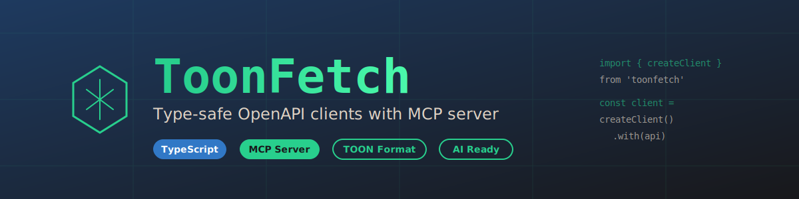

[](https://github.com/productdevbook/toonfetch)

# ToonFetch

<p>
  <a href="https://www.npmjs.com/package/toonfetch"></a>
  <a href="https://www.npmjs.com/package/toonfetch"></a>
  <a href="https://github.com/productdevbook/toonfetch/blob/main/LICENSE"></a>
  <a href="https://www.typescriptlang.org/"></a>
  <a href="https://github.com/productdevbook/toonfetch"></a>
</p>

> Type-safe OpenAPI clients with MCP server for AI-driven API exploration

## Table of Contents

- [What is ToonFetch?](#what-is-toonfetch)
- [Features](#features)
- [Installation](#installation)
- [Quick Start](#quick-start)
- [Supported APIs](#supported-apis)
- [MCP Server Setup](#mcp-server-setup)
- [Adding New APIs](#adding-new-apis)
- [Development](#development)
- [Troubleshooting](#troubleshooting)
- [Contributing](#contributing)

---

## What is ToonFetch?

ToonFetch combines two powerful tools:

1. **Type-Safe API Clients** - Generate fully-typed TypeScript clients from OpenAPI specifications
2. **MCP Server** - Let AI assistants (like Claude) explore your APIs and generate code

Built with [apiful](https://github.com/lisnote/apiful) and [TOON format](https://github.com/toon-format/toon) for efficient OpenAPI spec compression.

## Features

- ✨ **Fully Type-Safe** - Autocomplete and type checking for all API calls
- 🤖 **MCP Integration** - AI assistants can explore and generate code for your APIs
- 📦 **Compressed Specs** - TOON format reduces OpenAPI specs by 40-45%
- 🔄 **Auto-Discovery** - Automatic service detection and type generation
- 🛠️ **Modern Stack** - TypeScript 5.7, ESNext, strict mode
- 🧪 **Well-Tested** - 76+ tests with >60% coverage

## Installation

### For Using the API Client

```bash
# npm
npm install toonfetch

# pnpm
pnpm add toonfetch

# yarn
yarn add toonfetch
```

### For MCP Server (Global)

```bash
# Install globally
npm install -g toonfetch

# Verify installation
toonfetch-mcp --version
```

### For Development

```bash
git clone https://github.com/productdevbook/toonfetch.git
cd toonfetch
pnpm install
pnpm build
```

## Quick Start

### Using the Type-Safe API Client

```typescript
import { createClient, kratos } from 'toonfetch/ory'

// Create a typed client
const client = createClient({
  baseURL: 'https://your-api.com',
  headers: {
    'Authorization': 'Bearer your-token'
  }
}).with(kratos)

// Fully typed requests and responses
const schema = await client('/schemas/{id}', {
  method: 'GET',
  path: { id: 'default' }  // ✅ Type-checked
})

// TypeScript knows the response type
console.log(schema.properties)  // ✅ Autocomplete works
```

### Using with AI Assistants (MCP)

See the [MCP Server Setup](#mcp-server-setup) section below.

## Supported APIs

ToonFetch currently includes:

| API | Description | Endpoints | Import |
|-----|-------------|-----------|--------|
| **Ory Kratos** | Identity & user management | 50+ | `toonfetch/ory` |
| **Ory Hydra** | OAuth 2.0 & OpenID Connect | 40+ | `toonfetch/ory` |

**Want to add more?** See [Adding New APIs](#adding-new-apis).

## MCP Server Setup

The MCP server lets AI assistants (like Claude Desktop) explore your APIs and generate code examples.

### Prerequisites

- [Claude Desktop](https://claude.ai/download) (or another MCP client)
- Node.js 18+

### Step 1: Install

**Option A: Global Install (Recommended)**

```bash
npm install -g toonfetch
```

**Option B: npx (No install needed)**

```bash
# Just use npx in the config (see Step 2)
```

**Option C: Local Build (For contributors)**

```bash
git clone https://github.com/productdevbook/toonfetch.git
cd toonfetch
pnpm install && pnpm build
```

### Step 2: Configure Claude Desktop

#### Find the Config File

| OS | Path |
|----|------|
| **macOS** | `~/Library/Application Support/Claude/claude_desktop_config.json` |
| **Windows** | `%APPDATA%\Claude\claude_desktop_config.json` |
| **Linux** | `~/.config/Claude/claude_desktop_config.json` |

If the file doesn't exist, create it.

#### Add ToonFetch Server

**For Global Install:**

```json
{
  "mcpServers": {
    "toonfetch": {
      "command": "toonfetch-mcp"
    }
  }
}
```

**For npx (no install):**

```json
{
  "mcpServers": {
    "toonfetch": {
      "command": "npx",
      "args": ["-y", "toonfetch"]
    }
  }
}
```

**For Local Build:**

```json
{
  "mcpServers": {
    "toonfetch": {
      "command": "node",
      "args": ["/absolute/path/to/toonfetch/dist/mcp-server.js"]
    }
  }
}
```

**Finding the absolute path (Local Build only):**

```bash
# macOS/Linux
cd /path/to/toonfetch && echo "$(pwd)/dist/mcp-server.js"

# Windows PowerShell
cd C:\path\to\toonfetch; "$(Get-Location)\dist\mcp-server.js"
```

### Step 3: Restart Claude Desktop

1. Quit Claude Desktop completely
2. Reopen it
3. Look for the 🔌 MCP icon

### Step 4: Test It

In Claude Desktop, type:

```
List available APIs using toonfetch
```

Claude should show you the available APIs (Ory Kratos, Ory Hydra, etc.).

### Available MCP Tools

| Tool | Description |
|------|-------------|
| `list_apis` | List all available APIs |
| `get_api_info` | Get API metadata |
| `search_endpoints` | Search by path/method/description |
| `get_endpoint_details` | Get full endpoint specs |
| `get_schema_details` | Get data schemas |
| `generate_code_example` | Generate TypeScript code |
| `get_quickstart` | Get API quickstart guide |

## Adding New APIs

ToonFetch auto-discovers OpenAPI specs. Here's how to add your own:

### 1. Create Service Directory

```bash
mkdir -p openapi-specs/github
```

### 2. Add OpenAPI Spec (JSON)

```bash
# Download or copy your OpenAPI spec
cp ~/github-api.json openapi-specs/github/github.json
```

### 3. Create `apiful.config.ts`

```typescript
// openapi-specs/github/apiful.config.ts
import { defineConfig } from 'apiful'

export default defineConfig({
  openapis: {
    github: {                    // Must match filename
      filepath: './github.json'
    }
  },
  output: './types.d.ts'
})
```

### 4. Create `index.ts`

```typescript
// openapi-specs/github/index.ts
import { createClient as apifulCreateClient, OpenAPIBuilder } from 'apiful'

export { apifulCreateClient as createClient }
export const github = OpenAPIBuilder<'github'>()
export default { github }
```

### 5. Build

```bash
pnpm build
```

This automatically:
- ✅ Converts JSON to TOON (compressed)
- ✅ Generates TypeScript types
- ✅ Updates package.json exports
- ✅ Bundles to `dist/github.js`
- ✅ Makes it available in MCP server

### 6. Use It

```typescript
import { createClient, github } from 'toonfetch/github'

const client = createClient({
  baseURL: 'https://api.github.com',
  headers: { 'Authorization': 'token ghp_...' }
}).with(github)

// Fully typed!
const user = await client('/users/{username}', {
  method: 'GET',
  path: { username: 'octocat' }
})
```

## Development

### Setup

```bash
# Install
pnpm install

# Build
pnpm build

# Test
pnpm test

# Test with coverage
pnpm test:coverage

# Lint
pnpm lint:fix
```

### Scripts

| Script | Description |
|--------|-------------|
| `pnpm build` | Full build pipeline |
| `pnpm convert:toon` | Convert JSON to TOON |
| `pnpm generate:types` | Generate TypeScript types |
| `pnpm test` | Run all tests |
| `pnpm test:watch` | Run tests in watch mode |
| `pnpm lint` | Run ESLint |

### Project Structure

```
toonfetch/
├── src/mcp-server.ts           # MCP server
├── scripts/                     # Build scripts
├── openapi-specs/              # API specifications
│   └── ory/
│       ├── kratos.json         # OpenAPI spec
│       ├── kratos.toon         # Compressed TOON
│       ├── apiful.config.ts    # Type config
│       ├── index.ts            # Client exports
│       └── types.d.ts          # Generated types
├── test/                       # Tests (76+)
├── playground/                 # Examples
└── dist/                       # Compiled output
    ├── ory.js                  # Bundled client
    ├── ory.d.ts                # Type definitions
    └── mcp-server.js           # MCP executable
```

## Troubleshooting

### MCP Server Not Showing

**Check Config File:**
```bash
# macOS
cat ~/Library/Application\ Support/Claude/claude_desktop_config.json

# Validate JSON
node -e "JSON.parse(require('fs').readFileSync('path/to/config.json'))"
```

**Check MCP Server:**
```bash
# Global install
toonfetch-mcp
# Should output: "ToonFetch MCP server running on stdio"

# Local build
node /path/to/dist/mcp-server.js
```

**Check Claude Logs:**
```bash
# macOS
tail -f ~/Library/Logs/Claude/mcp*.log

# Windows
# Check %APPDATA%\Claude\Logs\
```

### Types Not Generated

```bash
# Manually generate
pnpm generate:types

# Check output
ls openapi-specs/*/types.d.ts
```

### Build Fails

```bash
# Clean install
rm -rf node_modules pnpm-lock.yaml dist
pnpm install
pnpm build
```

### Still Having Issues?

1. Check [CLAUDE.md](./CLAUDE.md) - Detailed docs
2. Search [issues](https://github.com/productdevbook/toonfetch/issues)
3. Create [new issue](https://github.com/productdevbook/toonfetch/issues/new) with:
   - Node version (`node --version`)
   - OS
   - Error message

## Why TOON Format?

TOON compresses OpenAPI specs by ~40-45%:

| Spec | JSON | TOON | Savings |
|------|------|------|---------|
| Ory Kratos | 134k tokens | 73k tokens | **45%** |
| Ory Hydra | 69k tokens | 40k tokens | **42%** |

**Benefits:**
- Fits more APIs in Claude's context
- Faster loading
- Lower token costs

Learn more: [TOON Format](https://github.com/toon-format/toon)

## Contributing

We welcome contributions! See [CONTRIBUTING.md](./CONTRIBUTING.md) for guidelines.

Quick start:

```bash
# Fork and clone
git clone https://github.com/productdevbook/toonfetch.git
cd toonfetch

# Create branch
git checkout -b feature/my-feature

# Make changes, add tests
pnpm test

# Lint
pnpm lint:fix

# Commit
git commit -m "feat: add my feature"
git push origin feature/my-feature
```

## Documentation

- [CLAUDE.md](./CLAUDE.md) - Comprehensive project docs
- [CONTRIBUTING.md](./CONTRIBUTING.md) - Contribution guide
- [test/README.md](./test/README.md) - Testing guide
- [Model Context Protocol](https://modelcontextprotocol.io/) - MCP specification

## License

MIT © 2025

## Acknowledgments

- [apiful](https://github.com/lisnote/apiful) - Type-safe OpenAPI client generator
- [TOON Format](https://github.com/toon-format/toon) - Spec compression
- [Ory](https://www.ory.sh/) - Open source identity infrastructure
- [Model Context Protocol](https://modelcontextprotocol.io/) - AI integration standard

---

**Made with ❤️ for developers**
